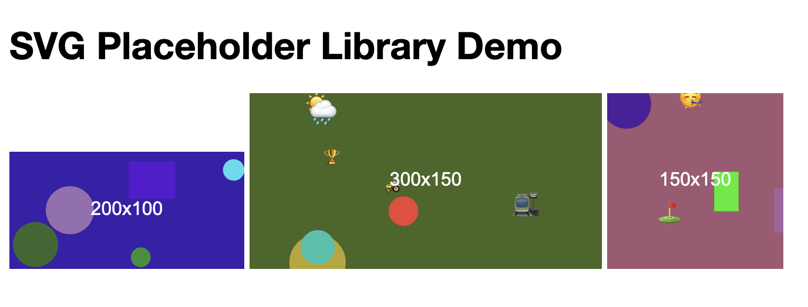

# SVG Placeholder Library

## Overview

SVG Placeholder Library is a lightweight JavaScript library that dynamically generates SVG placeholder images for web development. It replaces `` elements with specified classes with colorful, randomly generated SVG placeholders, making it easy to visualize layouts and design mockups without the need for external placeholder image services.



## Features

- Dynamically generates unique SVG placeholders
- Customizable dimensions through class names
- Colorful designs with random shapes and Unicode emoticons
- Displays image dimensions in the center of each placeholder
- Lightweight and easy to integrate into existing projects
- No external dependencies

## Installation

1. Download the `svg-placeholder-library.js` file from this repository.
2. Include the script in your HTML file:

```html
<script src="path/to/svg-placeholder-library.js"></script>
```

## Usage

1. Add the script to your HTML file as shown in the installation section.

2. Use `` elements with classes in the format `placeholder-[width]-[height]` where you want placeholder images:

```html


```

3. The library will automatically replace these images with SVG placeholders when the page loads.

## Customization

You can customize the appearance of the placeholders by modifying the `generateSVG()` method in the `SVGPlaceholder` object. Some ideas for customization:

- Change the background color generation
- Add new types of shapes or elements
- Modify the font or style of the dimension text
- Adjust the number or size of random elements

## Browser Compatibility

This library should work in all modern browsers that support SVG and ES6 JavaScript. It has been tested in the latest versions of Chrome, Firefox, Safari, and Edge.

## Contributing

Contributions to the SVG Placeholder Library are welcome! Please feel free to submit a Pull Request.

## License

This project is licensed under the MIT License - see the LICENSE file for details.

## Acknowledgments

- Inspired by placeholder image services and the need for a lightweight, customizable solution
- Uses Unicode ranges for emoticons to add visual interest to placeholders

## Contact

If you have any questions, issues, or suggestions, please open an issue in this repository.

Happy coding!
